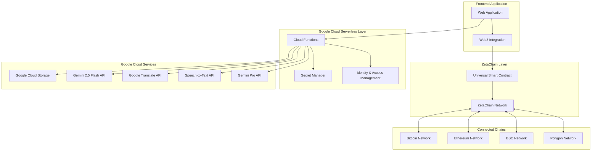

# DeLangZeta Design Document

## Overview

DeLangZeta is a decentralized language data platform built on ZetaChain's Universal Smart Contracts, creating a truly omnichain application that operates seamlessly across Bitcoin, Ethereum, BSC, Polygon, and other connected networks. The platform addresses critical issues in AI language data collection: data monopolies, bias, and unfair compensation.

**Key Omnichain Features:**
- **Universal Payments**: Users can sponsor tasks using BTC, ETH, USDC, or any supported token from their preferred network
- **Cross-Chain Rewards**: Contributors receive payments directly to Bitcoin addresses, Ethereum wallets, or any supported network
- **No Manual Bridging**: All cross-chain operations handled automatically by ZetaChain's protocol
- **Universal Gas**: Users pay transaction fees in their native tokens

The system integrates Google's AI services for intelligent verification and uses Google Cloud Storage for scalable data management, enabling LLM training and research applications while maintaining true omnichain accessibility.

## Architecture

### High-Level Architecture



### Core Components

1. **ZetaChain Universal Smart Contract**: Single omnichain contract deployed on ZetaChain that can interact with Bitcoin, Ethereum, BSC, Polygon and other connected chains
2. **Omnichain Payment System**: Cross-chain payment processing and reward distribution
3. **Google Cloud Serverless Security Layer**: Cloud Functions for secure API access and authentication
4. **Google AI Verification Engine**: Server-side integration with Gemini APIs through secure Cloud Functions
5. **Google Cloud Storage System**: Secure file operations through serverless functions with proper IAM controls
6. **Web Application**: Frontend application with secure serverless backend integration#
# Components and Interfaces

### 1. Google Cloud Serverless Security Layer

**Cloud Functions Architecture:**
- **Authentication Functions**: JWT token generation and validation for secure API access
- **File Upload Functions**: Secure signed URL generation and file validation
- **AI Processing Functions**: Server-side Google AI API calls with rate limiting and error handling
- **Data Verification Functions**: Secure processing of verification results and smart contract interactions
- **Cross-Chain Integration Functions**: Secure blockchain interaction and event processing

**Security Features:**
```typescript
// Authentication Cloud Function
interface AuthRequest {
  walletAddress: string;
  signature: string;
  message: string;
  chainId: number;
}

interface AuthResponse {
  accessToken: string;
  refreshToken: string;
  expiresIn: number;
  permissions: string[];
}

// Secure File Upload Function
interface SecureUploadRequest {
  taskId: string;
  fileType: string;
  fileSize: number;
  contentType: string;
  userToken: string;
}

interface SecureUploadResponse {
  uploadUrl: string;
  fileId: string;
  expiresAt: Date;
  maxFileSize: number;
}
```

**Additional Cloud Functions:**
- **Data Processing Functions**: Batch data verification and analysis with scheduled triggers
- **Blockchain Event Functions**: Event-driven monitoring of smart contract events via Pub/Sub
- **Analytics Functions**: Real-time metrics and reporting with Firestore integration
- **Rate Limiting Functions**: Distributed rate limiting using Cloud Firestore counters

**Identity & Access Management (IAM):**
- **Service Account Security**: Dedicated service accounts with minimal required permissions
- **API Key Management**: Secure storage and rotation of Google AI API keys in Secret Manager
- **Role-Based Access Control**: Granular permissions for different user types and operations
- **Audit Logging**: Comprehensive logging of all security-sensitive operations

**Secret Manager Integration:**
```typescript
// Secure API key retrieval
interface SecretConfig {
  geminiApiKey: string;
  translateApiKey: string;
  speechToTextApiKey: string;
  jwtSigningKey: string;
  databaseCredentials: string;
}

// Function to securely access secrets
async function getSecureConfig(): Promise<SecretConfig> {
  const secretManager = new SecretManagerServiceClient();
  // Secure retrieval from Google Secret Manager
}
```#
## 2. ZetaChain Universal Smart Contract

**Universal Contract Architecture:**
- **Single Deployment**: One contract on ZetaChain that handles all omnichain operations
- **Cross-Chain State**: Unified state management across Bitcoin, Ethereum, BSC, Polygon
- **Omnichain Messaging**: Direct communication with external chains via ZetaChain's protocol
- **Universal Gas**: Users pay gas in their native tokens (BTC, ETH, etc.)

**Core Universal Functions:**
```solidity
// Omnichain task creation - accepts payments from any connected chain
function createTaskOmnichain(
    TaskSpec calldata spec,
    uint256 sourceChainId,
    address paymentToken,
    uint256 amount
) external;

// Cross-chain data submission
function submitDataOmnichain(
    string calldata taskId,
    string calldata storageUrl,
    bytes calldata metadata,
    uint256 preferredRewardChain
) external;

// Omnichain reward distribution
function distributeRewardsOmnichain(
    string calldata taskId,
    address[] calldata recipients,
    uint256[] calldata amounts,
    uint256[] calldata targetChains
) external;

// Cross-chain license purchase
function purchaseLicenseOmnichain(
    string calldata datasetId,
    uint256 sourceChainId,
    address paymentToken,
    uint256 amount
) external;
```

**Omnichain State Management:**
- **Cross-Chain Task Registry**: Tasks funded from any chain, accessible universally
- **Universal Reputation System**: Contributor scores tracked across all chains
- **Omnichain Reward Pool**: Automatic distribution to user's preferred networks
- **Cross-Chain License Tracking**: Dataset access rights managed universally

**ZetaChain Protocol Integration:**
- **Inbound Transactions**: Receive BTC, ETH, ERC-20 tokens from external chains
- **Outbound Transactions**: Send rewards to Bitcoin addresses, Ethereum wallets, etc.
- **Cross-Chain Events**: Emit events that trigger actions on external chains
- **Universal Gas Abstraction**: Users pay gas in their preferred tokens### 3. 
Google AI Verification Engine (Serverless)

**Secure Gemini 2.5 Flash Integration:**
```typescript
// Cloud Function for secure AI verification
interface SecureVerificationRequest {
  submissionId: string;
  dataType: 'text' | 'audio' | 'image';
  storageUrl: string; // Google Cloud Storage URL
  language: string;
  taskCriteria: TaskCriteria;
  userToken: string;
}

interface SecureVerificationResponse {
  submissionId: string;
  qualityScore: number; // 0-100
  languageDetected: string;
  issues: string[];
  recommendations: string[];
  confidence: number;
  processingTime: number;
  costEstimate: number;
}
```

**Serverless Multi-Service Pipeline:**
1. **Authentication Validation**: Verify user JWT token and permissions
2. **File Access Control**: Validate user access to submitted data in Google Cloud Storage
3. **Language Detection**: Secure Google Translate API calls with rate limiting
4. **Content Analysis**: Protected Gemini 2.5 Flash API integration with error handling
5. **Audio Processing**: Secure Speech-to-Text API calls with content validation
6. **Advanced Analysis**: Gemini Pro integration with cost monitoring and usage tracking
7. **Result Storage**: Secure storage of verification results with audit trails

**Security Enhancements:**
- **API Key Protection**: All Google AI API keys stored in Secret Manager, never exposed to frontend
- **Rate Limiting**: Per-user and per-IP rate limiting to prevent abuse
- **Content Validation**: Server-side validation of all submitted content before AI processing
- **Cost Controls**: Usage monitoring and automatic throttling to prevent excessive API costs
- **Audit Logging**: Complete audit trail of all AI processing requests and results## Da
ta Models

### Task Model
```typescript
interface Task {
  id: string;
  creator: string;
  title: string;
  description: string;
  language: string;
  dataType: 'text' | 'audio' | 'image' | 'video';
  criteria: TaskCriteria;
  reward: {
    total: bigint;
    perSubmission: bigint;
    token: string;
    network: string;
  };
  deadline: Date;
  status: 'active' | 'completed' | 'expired';
  submissions: Submission[];
}
```

### Submission Model
```typescript
interface Submission {
  id: string;
  taskId: string;
  contributor: string;
  storageUrl: string; // Google Cloud Storage URL
  metadata: {
    language: string;
    wordCount?: number;
    duration?: number;
    fileSize: number;
    mimeType: string;
  };
  verification: {
    aiScore: number;
    validatorScores: number[];
    finalScore: number;
    status: 'pending' | 'verified' | 'rejected';
  };
  rewards: {
    amount: bigint;
    token: string;
    network: string;
    paid: boolean;
  };
}
```

### User Profile Model
```typescript
interface UserProfile {
  address: string;
  reputation: number;
  statistics: {
    contributionsCount: number;
    validationsCount: number;
    totalEarned: bigint;
    averageQuality: number;
  };
  preferences: {
    payoutNetwork: string;
    preferredToken: string;
    languages: string[];
  };
  stakes: {
    validatorStake: bigint;
    governanceTokens: bigint;
  };
}
```## Error
 Handling

### Smart Contract Error Handling
- **Insufficient Payment**: Revert with clear error message and required amount
- **Invalid Task Parameters**: Validate all inputs before state changes
- **Cross-chain Failures**: Implement rollback mechanisms for failed omnichain operations
- **Unauthorized Access**: Role-based access control with proper error messages
- **Server Signature Validation**: Reject transactions without valid serverless function signatures

### Serverless Function Error Handling
- **Authentication Failures**: JWT token validation with clear error responses
- **Google API Failures**: Graceful degradation with fallback mechanisms
- **Rate Limiting**: Per-user and global rate limiting with queue management
- **Secret Access Failures**: Secure fallback when Secret Manager is unavailable
- **Function Timeouts**: Automatic retry logic with exponential backoff
- **Cold Start Optimization**: Pre-warming strategies for critical functions

### API Error Handling
- **Google AI API Failures**: Circuit breaker pattern with community-only validation fallback
- **Network Connectivity**: Retry mechanisms with exponential backoff and jitter
- **Rate Limiting**: Intelligent queue management for high-volume operations
- **Data Corruption**: Checksum validation and automatic re-upload with audit logging
- **Cost Overruns**: Automatic throttling when API usage exceeds budget thresholds

### Security Error Handling
- **Invalid JWT Tokens**: Automatic token refresh with secure fallback
- **Unauthorized File Access**: Detailed audit logging with immediate access revocation
- **Suspicious Activity**: Automatic rate limiting and security event notifications
- **API Key Compromise**: Automatic key rotation and service isolation
- **Cross-Site Request Forgery**: CSRF token validation with secure headers

### User Experience Error Handling
- **Wallet Connection Issues**: Clear instructions for different wallet types with troubleshooting guides
- **Transaction Failures**: Detailed error messages with suggested solutions and retry options
- **File Upload Problems**: Progress indicators, retry mechanisms, and alternative upload methods
- **Payment Processing**: Real-time status updates and failure notifications with support contact
- **Authentication Errors**: Clear guidance for wallet signature and token refresh processes## Testing 
Strategy

### Smart Contract Testing
- **Unit Tests**: Individual function testing with edge cases and security validations
- **Integration Tests**: Cross-chain payment and reward distribution with serverless validation
- **Security Audits**: Third-party security review focusing on serverless integration points
- **Testnet Deployment**: Comprehensive testing on ZetaChain testnet with mock serverless functions
- **Server Signature Testing**: Validate all server-signed transactions and authentication flows

### Serverless Function Testing
- **Unit Tests**: Individual Cloud Function testing with mocked dependencies
- **Integration Tests**: End-to-end testing of Cloud Functions with Google AI APIs
- **Security Tests**: Authentication, authorization, and input validation testing
- **Performance Tests**: Load testing and cold start optimization validation
- **Error Handling Tests**: Comprehensive error scenario testing with fallback mechanisms
- **Secret Management Tests**: Secure access to Secret Manager and key rotation testing

### Frontend Testing
- **Component Tests**: React component testing with Jest and React Testing Library
- **Responsive Testing**: Automated testing across multiple screen sizes and orientations
- **Mobile Device Testing**: Real device testing on iOS and Android platforms
- **Touch Interaction Testing**: Gesture and touch event validation
- **E2E Tests**: User workflow testing with Playwright across desktop and mobile
- **Cross-browser Testing**: Compatibility across Chrome, Safari, Firefox, Edge
- **Performance Testing**: Mobile performance optimization and loading speed tests
- **Accessibility Testing**: Screen reader compatibility and keyboard navigation
- **PWA Testing**: Offline functionality and mobile app-like behavior validation
- **Security Testing**: JWT token handling, secure storage, and CSRF protection

### Cross-chain Testing
- **Multi-network Payments**: Test payments from Bitcoin, Ethereum, BSC, Polygon with serverless validation
- **Reward Distribution**: Verify rewards reach correct networks with server-side validation
- **Atomic Operations**: Ensure transaction atomicity across chains with rollback mechanisms
- **Network Failure Recovery**: Test behavior when individual networks are unavailable
- **Server-side Validation**: Test all cross-chain operations include proper serverless validation

### Performance and Scalability Testing
- **Load Testing**: Test serverless functions under high concurrent load
- **Cost Optimization**: Monitor and optimize Google Cloud costs under various usage patterns
- **Auto-scaling**: Verify Cloud Functions scale appropriately
- **Latency Testing**: Measure and optimize response times for all serverless operations
- **Resource Monitoring**: Test monitoring and alerting for resource usage and errors